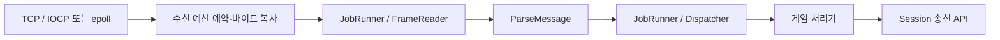

# 아키텍처

ServerCore는 서버 실행에 필요한 전송·프로토콜·세션·작업 실행을 조립하는 Windows·Linux용 C++20 정적 라이브러리다. 애플리케이션이 `main`, 게임 규칙과 배포 설정을 제공하고, `ServerHost`가 연결과 실행 스레드의 수명을 관리한다. 공개 계약은 [include/ServerCore](../include/ServerCore), 구현은 [src](../src)를 기준으로 한다.

## 1. 모듈과 확장 위치

웹 서버와 게임 서버가 공유하는 모듈 의존 방향, 오류·소유권·취소 계약과 실행기 선택은 [실행·취소·흐름 제어](EXECUTION_AND_FLOW_CONTROL.md)를 따른다. `TaskExecutor`는 프로토콜과 독립적인 제한된 병렬 실행기이며, 게임 상태의 직렬 실행은 계속 `JobRunner`가 담당한다.

| 모듈 | 공개 API와 책임 | 대표 구현 |
| --- | --- | --- |
| Core | `Status`/`Result`, 버퍼, 설정, 로깅, 시계와 작업 큐 | [src/Core](../src/Core) |
| Net | `IoContext`, `Acceptor`, `Connection`: TCP 수락과 비동기 송수신. 내부 `DatagramSocket`: 비차단 IPv4 UDP와 플랫폼 소켓 수명 | [src/Net](../src/Net) |
| Web | `HttpServer`: HTTP/1.1 요청과 WebSocket 처리. 사용 계약은 [HTTP·WebSocket](WEB.md) 참조 | [src/Web](../src/Web) |
| Protocol | 길이 프레임, JSON 값·봉투, 준비된 송신 값, datagram 포맷 | [src/Protocol](../src/Protocol) |
| Session | 게임이 다루는 연결 상대, ID와 등록표, 수명 관찰자 | [Session.h](../include/ServerCore/Session/Session.h), [SessionRegistry.cpp](../src/Session/SessionRegistry.cpp) |
| Dispatch | 메시지 타입 등록, 본문 크기 검사와 처리기 호출 | [Dispatcher.cpp](../src/Dispatch/Dispatcher.cpp) |
| Runtime | `ServerHost`, 직렬 `JobRunner`, 주기 작업과 지표, `DatagramTransport`의 토큰·순번·endpoint 관리 | [src/Runtime](../src/Runtime) |

디렉터리 이름만으로 의존 방향을 판단하지 않는다. `Runtime`의 범용 실행기는 Host 조립보다 아래에 있고, `Observability`의 지표 값과 Prometheus 출력 어댑터도 서로 다른 층이다. [계층 검사](../cmake/CheckLayers.cmake)는 다음 책임을 구분한다. 이는 내부 소스 경계이며 각각 별도 라이브러리 타깃을 만드는 구조는 아니다.

| 검사 계층 | 포함하는 코드와 의존 경계 |
| --- | --- |
| Core | 상태·오류·버퍼·설정·로그 인터페이스. 상위 서버 프로토콜을 참조하지 않는다. |
| Metrics | `Observability/Metrics.h`, `RequestTrace.h`와 내부 집계 도구. 서버 객체를 소유하지 않는 관측 값·계약이다. |
| Logging | `Observability/AsyncLogger`. Core와 관측 계약을 사용하며 웹·게임 Host에 의존하지 않는다. |
| Net / Protocol | Core 위의 전송과 메시지 표현. 서로의 구현이나 Host·Web을 참조하지 않는다. |
| Session / Dispatch | Protocol 위의 세션·메시지 처리 계약. 네트워크 구현과 웹 서버를 참조하지 않는다. |
| Execution | `JobRunner`, `TaskExecutor`, `PeriodicRunner`. Core·Metrics 위에서 실행하며 Net·Session·Web·Host를 요구하지 않는다. |
| HostMetrics / Host | `Runtime/Metrics.h`의 게임 서버 스냅샷과 나머지 Runtime의 게임 서버 조립. 실행기·전송·프로토콜·세션을 결합한다. |
| Web | HTTP·WebSocket, 스트리밍과 HTTP 관측 구현. Net·Execution·Metrics를 사용하며 게임 Host·Session·Dispatch를 요구하지 않는다. |
| Export | `Observability/Prometheus`. Metrics·HostMetrics 값을 텍스트로 바꾸는 상위 어댑터다. Web과 Execution은 이를 참조하지 않는다. |
| C | 위 서버 기능을 외부 언어의 소유 handle과 이벤트로 변환하는 경계다. 코어 계층에서 C ABI로 역의존하지 않는다. |

`HttpObservationInternal`은 HTTP 응답 수명에 결합된 구현이므로 `src/Web`에 둔다. 네트워크의 소켓·송신 예산 내부 구현은 Net이 소유하고 상위 조립층은 전송 API를 사용한다. 예외는 공개 raw UDP API가 없는 `DatagramTransport.cpp`의 `Net/DatagramSocket.h` 직접 사용 한 곳이며 검사에 명시한다. 플랫폼 수락기·연결·송신 예산 내부에는 이 예외를 확대하지 않는다. 관측 계약이 공유된다는 이유로 HTTP 구현이나 Prometheus 변환을 하위 실행기에 넣지 않는다.

계층 검사는 `include/ServerCore`와 `src`의 직접 `#include`를 검사하며 비활성 플랫폼 분기도 읽는다. 공개 헤더의 private 구현 노출과 금지된 의존 방향을 검사하고 새 파일은 명시적으로 계층을 배정한다. 공개 헤더 전체를 컴파일하는 `PublicHeaderCompileCheck.cpp`는 의도적인 합본이므로 제외한다. C++ 의미 분석·링크 분석이나 전처리 매크로로 만든 include 분석은 수행하지 않으므로 동작·수명 회귀 검사를 대신하지 않는다. 독립 실행은 `cmake -P cmake/CheckLayers.cmake`, CTest 이름은 `ServerCore.Architecture.LayerBoundaries`다.

게임별 메시지는 Host의 Dispatcher에 등록한다. 연결 수명은 `ISessionObserver`로 관찰하고, 주기 게임 작업은 Host에서 얻은 `JobRunner::Lease`와 `PeriodicRunner`로 예약한다. 방·인증 규칙·DB·AOI 같은 게임 기능은 이 공개 API를 소비하는 별도 애플리케이션에 둔다. 운영체제 구조체와 내부 `NetworkSession`, 파싱 풀은 공개 확장 지점이 아니다.

라우팅·인증 정책 콜백·세션 인증 상태·입력 제한·파일/SSE 전송·설정 읽기·로그 회전은 여러 백엔드가 공유하는 서버 기반이므로 유지한다. 자격 증명 검증, 플러그인 발견·실행·복구, UI·VRM 검증, `202` 작업의 업무 상태, DB·매치메이킹과 Git 배포는 소비 애플리케이션의 책임이다. 이들 애플리케이션 기능이 구현되어 있다가 제거된 것으로 설명하지 않는다. 실제로 제거한 제공 기능은 외부 HTTP 클라이언트이며 이전 범위는 [API 이전 안내](API_MIGRATION.md)를 따른다.

Windows TCP 구현은 `src/Net`의 IOCP 소스를, Linux는 `src/Net/Linux`의 epoll 소스를 사용한다. CMake가 플랫폼에 맞는 소스와 시스템 의존성을 선택한다. 설정 파일 접근과 UDP 토큰 난수 생성도 플랫폼별로 처리하고 상위 세션·디스패치 계약은 공유한다.

플랫폼마다 달라지지 않아야 하는 정책은 내부 공통 구현에 둔다. `SendQueue`가 송신 payload 소유권·부분 전송 위치·보관 메모리 예산을 관리하고, TCP와 UDP는 같은 IPv4 주소 검증을 사용한다. 송신·수신·파싱 예산의 원자적 예약·반납도 Core의 동일한 계산을 사용한다. 커널이 송신 버퍼를 참조하는 기간과 I/O 취소·완료 처리는 각 OS 구현이 책임진다.

JSON 텍스트·바이트·메시지 진입점은 문서 검증과 예외 변환을 공유한다. 메시지 송수신도 같은 봉투 필드 규칙을 사용하지만, 잘못된 수신 데이터의 `InvalidFormat`과 호출자가 잘못 구성한 송신 인자의 `InvalidArgument`는 구분한다. 원시 UDP의 빈 datagram과 응용 프로토콜이 금지하는 빈 payload처럼 계층 목적에 따른 차이는 유지한다.

`Web::HttpServer`는 길이 프레임 기반 `ServerHost`와 독립적으로 HTTP/1.1·WebSocket을 조립한다. HTTP 처리기는 제한된 TaskExecutor에서 소유 요청 문맥을 받고 응답 작성기로 완료한다. 기존 완성 응답 어댑터·스트리밍·파일·SSE는 헤더 인코딩과 송신 예산을 공유한다. 연결마다 진행 중 응답 하나와 제한된 pipeline 버퍼를 유지한다. 서버 HTTP/2·HTTP/3 및 TLS는 제공하지 않으며 실행·종료 계약은 [웹 서버 문서](WEB.md)를 따른다.

외부 HTTP 요청이 필요한 백엔드는 소비 애플리케이션이 선택한 전송 구현을 사용한다. 비동기 HTTP 처리기의 소유 문맥을 보관하고 외부 작업의 완료 때 응답할 수 있으며, 응답 작성기의 취소 토큰을 그 작업의 취소 체계에 연결한다. 외부 전송과 DNS·TLS 구현은 ServerCore에 포함하지 않는다.

## 2. 시작과 실행 문맥

애플리케이션은 `SetLogger`, `Configure`, 처리기·관찰자 등록을 끝낸 뒤 `Start()`를 호출한다. Host는 IoContext와 JobRunner, 필요한 파싱 worker와 만료 검사 타이머를 준비하고, Dispatcher 등록표를 동결한 뒤 수락을 시작한다. `Start()`의 성공은 포트가 열렸음을 뜻한다.

`Run()`은 종료 완료까지 호출 스레드를 대기시킨다. 이미 시작한 Host의 네트워크 이벤트를 직접 처리하는 루프가 아니므로, `Run()` 호출 전에도 연결 수락과 처리기가 실행될 수 있다. 시작 전에 `JobRunner::Lease`로 넣은 작업 역시 포트 개방 전에 실행될 수 있다.

| 실행 문맥 | 담당 작업 | 호출자가 지킬 경계 |
| --- | --- | --- |
| I/O worker | Windows의 IOCP 완료 또는 Linux의 epoll 이벤트, 수신 바이트 전달 | 오래 걸리는 게임 작업이나 Host 종료 대기를 하지 않는다 |
| JobRunner 한 스레드 | 프레임 분리, 세션 등록표, 게임 처리기, 일반 수명 통지, 주기 콜백 | 게임 상태를 이 문맥에서 직렬화하고 블로킹 작업을 피한다 |
| 선택적 parse worker | 완결 JSON 본문 해석 | 게임 처리기와 Registry를 실행하지 않는다 |
| PeriodicRunner 타이머 | 시간 측정과 JobRunner 예약 | 실제 게임 콜백은 JobRunner에서 실행된다 |
| 외부 제어 스레드 | 초기 구성, `Run()`, `Stop()` | Registry와 지표를 직접 읽지 않고 JobRunner에 요청한다 |

`GetSessions()`와 `SnapshotMetrics()`는 JobRunner 문맥에서 사용한다. `GetJobRunner()`는 작업 제출과 정지 상태 조회를 위한 Lease를 제공하며, 애플리케이션이 Host 소유 실행자를 멈추거나 직접 실행하는 기능은 제공하지 않는다. 여러 I/O·파싱 worker를 사용하더라도 게임 처리기는 같은 JobRunner에서 직렬 실행된다.

근거: [ServerHost.h](../include/ServerCore/Runtime/ServerHost.h), [JobRunner.h](../include/ServerCore/Runtime/JobRunner.h), [PeriodicRunner.h](../include/ServerCore/Runtime/PeriodicRunner.h).

## 3. 수신과 디스패치

TCP 수신 단위는 프레임 단위와 다르다. `FrameReader`가 4바이트 little-endian 길이와 본문을 조립한다. 위 흐름은 기본 JSON 모드이며 `ParseMessage()`가 JSON과 봉투를 검증한다. 바이너리 모드는 동일한 길이 프레임 안의 숫자 타입 봉투를 읽고 등록된 binary 처리기로 전달한다. 프레임이 나뉘거나 여러 개가 함께 도착할 수 있다. 와이어 형식은 [프로토콜](PROTOCOL.md)을 따른다.

`parseWorkerThreadCount`가 0이면 파싱도 JobRunner에서 실행된다. 양수이면 완결 본문을 별도 worker에서 해석한 후 JobRunner로 돌려보낸다. 같은 세션의 처리 순서를 유지하지만 여러 세션 사이의 전역 수신 시각 순서를 약속하지 않는다.

Dispatcher는 등록된 처리기를 현재 스레드에서 호출한다. 등록표는 Host 시작 시 동결되어 실행 중 변경하지 않는다. 처리기의 실패 Status는 기록되지만 자동 오류 응답이나 연결 종료가 되지는 않는다. 게임 정책에 따라 처리기가 Session API로 응답·종료를 선택한다. 프레임이나 JSON 자체의 오류는 Host의 해당 세션 종료 경로로 들어간다.

## 4. 송신과 자원 예산

`Session::Send()`는 `MessageFields`가 빌리는 값들을 호출 중 직렬화하고 프레임을 만든다. 비동기 송신 큐가 바이트 사본을 소유하므로 호출이 끝나면 원본 JSON을 계속 유지할 필요가 없다. 수신 `Message`는 값을 소유하지만, 처리기에서 받은 참조를 나중에 쓰려면 필요한 값을 복사해야 한다.

동일한 메시지를 재사용할 때는 `PrepareJsonValue`, `PrepareMessage`, `PrepareArrayMessage`와 `SendPrepared`를 사용한다. 실제 Host의 NetworkSession은 준비된 봉투를 다시 JSON으로 직렬화하지 않는다. 사용자 정의 Session의 기본 `SendPrepared`는 호환성을 위해 파싱 후 기존 가상 `Send`에 위임한다. 준비된 값에도 동일한 프레임·큐 상한이 적용된다.

| 제한 경계 | 제한 대상 | 한도에 도달했을 때 |
| --- | --- | --- |
| 동시 세션 수 | 등록 전 후보부터 transport 종료 정리까지의 outstanding 세션 | 새 연결을 닫는다 |
| 프레임 저장소 | 연결별 `maxBodySize + 4`와 최대 연결 수의 곱 | 과도한 설정 조합을 Configure에서 거절한다 |
| 수신 대기 바이트 | I/O에서 복사한 대기·처리 중 배치의 연결별·Host 전체 합 | 해당 연결을 `TooLarge`로 닫는다 |
| 파싱 대기 바이트·태스크 | worker 모드의 순서 대기·실행·결과 적용 예약 | 해당 연결을 `TooLarge`로 닫는다 |
| 송신 큐 | 연결별·Host 공유 payload 예산 | 프레임 전체를 거절하고 `WouldBlock`을 반환한다 |

송신 성공은 로컬 큐의 수락이며 원격 애플리케이션의 수신 확인이 아니다. `WouldBlock`으로 거절한 메시지는 자동 재시도하지 않는다. 최신 상태를 병합하거나 이벤트를 재시도할지, 상대를 종료할지는 게임이 결정한다. 각 기본값과 메모리 계산 범위는 [지원 범위와 설정](SUPPORT_AND_LIMITS.md)에 있다.

`DatagramCodec`은 28바이트 머리와 최대 1,200바이트 datagram 형식을 다루는 독립적인 헤더 API다. [Runtime::DatagramTransport](../include/ServerCore/Runtime/DatagramTransport.h)는 이 형식 위에서 비차단 UDP 소켓, 난수 토큰의 등록·폐기, replay 거절, endpoint 재바인딩과 지표를 관리한다. Net의 내부 소켓은 게임 메시지나 SessionId를 알지 않는다.

UDP 수신 순서는 `Decode → token/순번 검사 → ParseMessage → admission → 등록·순번 재검사 → endpoint/ready/순번 확정 → receiver`다. JSON은 한 번만 파싱하며 admission 거절이나 예외는 순번과 endpoint를 바꾸지 않는다. 콜백은 상태 mutex 밖에서 실행하고, admission 중 Close·재바인딩·등록 교체가 일어나면 해당 패킷을 적용하지 않는다. 메시지 참조는 동기 콜백 동안만 유효하다.

소비자가 `Poll` 또는 `PollBinary`를 같은 실행 문맥에서 직렬 호출하며 나머지 메서드는 스레드 안전하다. 기본 Poll은 수신 시도 4,096회와 약 1 MiB에서 멈추고, 손상 패킷과 소켓 오류도 한도를 소비한다. 자체 스레드나 송신 대기열은 없다. `ServerHost::AttachDatagramTransport`로 시작 전에 연결하면 Host가 TCP 세션 수명에 맞춰 UDP 등록·폐기를 수행한다. 전송 생성·설정과 poll 실행, 신뢰 채널에서의 토큰 배포, 허용 메시지·응답·유실 복구·주기·게임 송신 예산은 소비자 책임이다.

## 5. 소유권과 종료

Host는 연결 수락기, IoContext, 실행 스레드와 살아 있는 세션을 소유한다. 세션은 자신의 Connection과 프레임·대기열 상태를 소유하며 Host는 약하게 참조한다. 진행 중인 I/O 요청은 Connection과 버퍼가 완료 통지까지 살아 있도록 소유권을 유지한다. 취소 요청만으로 I/O 저장소를 즉시 해제하지 않는다.

애플리케이션이 세션을 보관할 때는 `weak_ptr`를 사용하고 사용 시점에 잠근다. 세션 관찰자도 Host가 약하게 참조하므로 애플리케이션이 필요한 기간 동안 소유해야 한다. Dispatcher의 lambda 캡처는 강하게 보관되므로 Host를 역참조하는 소유 순환을 만들지 않도록 한다.

`Disconnect()`는 즉시 종료를 요청한다. `SendAndDisconnect()`는 마지막 봉투를 큐에 넣고 drain을 요청하지만, peer 종료·Host Stop·즉시 Disconnect 또는 `gracefulCloseTimeout`이 이를 중단할 수 있다. graceful timeout은 상대가 추가 바이트를 보내도 연장되지 않는다.

`ServerHost::Stop()`은 수락을 멈추고 세션 종료, 수명 통지와 소유 스레드의 정리를 기다린다. Host의 I/O·JobRunner·parse worker에서는 자신을 기다리는 호출이 되므로 Stop을 호출하지 않는다. 자원 고갈 fallback으로 외부 스레드에서 동기 실행되는 종료 관찰자에는 별도 재진입 계약이 있으며, 정확한 대기 경계는 [Stop 선언](../include/ServerCore/Runtime/ServerHost.h)을 따른다. 일반적인 애플리케이션은 메인 또는 별도 제어 스레드에서 종료한다.

종료한 Host와 `Starting` 진입 이후 부팅에 실패한 Host는 재시작하지 않는다. 새 실행에는 새 `ServerHost`를 만든다. 반복·동시 종료, 부분 수신·송신, 파싱 순서와 예산 회수는 [Host 회귀 검사](../tests/Runtime/ServerHostTest.cpp)와 [전송 회귀 검사](../tests/Net/TransportTest.cpp)에서 다룬다. 검사 실행은 [빌드·테스트·배포](BUILD_TEST_DEPLOY.md)를 참고한다.

## 외부 언어 경계와 운영 도구

`src/C`는 기존 C++ 웹·TCP 서버 API를 소유 handle과 제한된 pull event queue로 감쌉니다. Rust 코드는 `servercore-sys`의 C ABI 선언 위에 `servercore`의 안전한 객체·Future를 사용합니다. C++에서 Rust 콜백을 호출하지 않으며, 이벤트 조회가 반환한 view의 수명은 소유 이벤트에 묶입니다. 자세한 경계와 현재 노출 범위는 [C ABI](C_ABI.md), 비동기 대기 및 Cargo 소비는 [Rust](RUST.md)를 참고합니다.

`Observability::AsyncLogger`는 기존 ILogger를 구현하고 별도 출력 스레드를 소유합니다. 작업·HTTP 메트릭은 고정 크기 스냅샷이며 HTTP 종료 추적은 별도 제한된 worker 큐를 사용합니다. 파일 출력·외부 추적 콜백을 전송 잠금 아래에서 실행하지 않습니다. [운영 도구](OPERATIONS.md)에 손실 집계·지연·종료 계약을 명시합니다.
