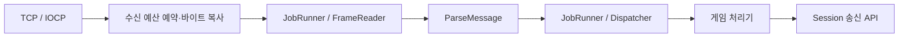

# 아키텍처

ServerCore는 서버 실행에 필요한 전송·프로토콜·세션·작업 실행을 조립하는 Windows용 C++20 정적 라이브러리다. 애플리케이션이 `main`, 게임 규칙과 배포 설정을 제공하고, `ServerHost`가 연결과 실행 스레드의 수명을 관리한다. 공개 계약은 [include/ServerCore](../include/ServerCore), 구현은 [src](../src)를 기준으로 한다.

## 1. 모듈과 확장 위치

| 모듈 | 공개 API와 책임 | 대표 구현 |
| --- | --- | --- |
| Core | `Status`/`Result`, 버퍼, 설정, 로깅, 시계와 작업 큐 | [src/Core](../src/Core) |
| Net | `IoContext`, `Acceptor`, `Connection`: TCP 수락과 비동기 송수신 | [src/Net](../src/Net) |
| Protocol | 길이 프레임, JSON 값·봉투, 준비된 송신 값, datagram 포맷 | [src/Protocol](../src/Protocol) |
| Session | 게임이 다루는 연결 상대, ID와 등록표, 수명 관찰자 | [Session.h](../include/ServerCore/Session/Session.h), [SessionRegistry.cpp](../src/Session/SessionRegistry.cpp) |
| Dispatch | 메시지 타입 등록, 본문 크기 검사와 처리기 호출 | [Dispatcher.cpp](../src/Dispatch/Dispatcher.cpp) |
| Runtime | `ServerHost`, 직렬 `JobRunner`, 주기 작업과 지표 | [src/Runtime](../src/Runtime) |

게임별 메시지는 Host의 Dispatcher에 등록한다. 연결 수명은 `ISessionObserver`로 관찰하고, 주기 게임 작업은 Host에서 얻은 `JobRunner::Lease`와 `PeriodicRunner`로 예약한다. 방·인증 규칙·DB·AOI 같은 게임 기능은 이 공개 API를 소비하는 별도 애플리케이션에 둔다. Windows 구조체와 내부 `NetworkSession`, 파싱 풀은 공개 확장 지점이 아니다.

## 2. 시작과 실행 문맥

애플리케이션은 `SetLogger`, `Configure`, 처리기·관찰자 등록을 끝낸 뒤 `Start()`를 호출한다. Host는 IOCP와 JobRunner, 필요한 파싱 worker와 만료 검사 타이머를 준비하고, Dispatcher 등록표를 동결한 뒤 수락을 시작한다. `Start()`의 성공은 포트가 열렸음을 뜻한다.

`Run()`은 종료 완료까지 호출 스레드를 대기시킨다. 이미 시작한 Host의 네트워크 이벤트를 직접 처리하는 루프가 아니므로, `Run()` 호출 전에도 연결 수락과 처리기가 실행될 수 있다. 시작 전에 `JobRunner::Lease`로 넣은 작업 역시 포트 개방 전에 실행될 수 있다.

| 실행 문맥 | 담당 작업 | 호출자가 지킬 경계 |
| --- | --- | --- |
| IOCP worker | AcceptEx·WSARecv·WSASend 완료, 수신 바이트 전달 | 오래 걸리는 게임 작업이나 Host 종료 대기를 하지 않는다 |
| JobRunner 한 스레드 | 프레임 분리, 세션 등록표, 게임 처리기, 일반 수명 통지, 주기 콜백 | 게임 상태를 이 문맥에서 직렬화하고 블로킹 작업을 피한다 |
| 선택적 parse worker | 완결 JSON 본문 해석 | 게임 처리기와 Registry를 실행하지 않는다 |
| PeriodicRunner 타이머 | 시간 측정과 JobRunner 예약 | 실제 게임 콜백은 JobRunner에서 실행된다 |
| 외부 제어 스레드 | 초기 구성, `Run()`, `Stop()` | Registry와 지표를 직접 읽지 않고 JobRunner에 요청한다 |

`GetSessions()`와 `SnapshotMetrics()`는 JobRunner 문맥에서 사용한다. `GetJobRunner()`는 작업 제출과 정지 상태 조회를 위한 Lease를 제공하며, 애플리케이션이 Host 소유 실행자를 멈추거나 직접 실행하는 기능은 제공하지 않는다. 여러 I/O·파싱 worker를 사용하더라도 게임 처리기는 같은 JobRunner에서 직렬 실행된다.

근거: [ServerHost.h](../include/ServerCore/Runtime/ServerHost.h), [JobRunner.h](../include/ServerCore/Runtime/JobRunner.h), [PeriodicRunner.h](../include/ServerCore/Runtime/PeriodicRunner.h).

## 3. 수신과 디스패치

TCP 수신 단위는 프레임 단위와 다르다. `FrameReader`가 4바이트 little-endian 길이와 UTF-8 JSON 봉투를 조립하고 `ParseMessage()`가 JSON과 봉투를 검증한다. 프레임이 나뉘거나 여러 개가 함께 도착할 수 있다. 와이어 형식은 [프로토콜](PROTOCOL.md)을 따른다.

`parseWorkerThreadCount`가 0이면 파싱도 JobRunner에서 실행된다. 양수이면 완결 본문을 별도 worker에서 해석한 후 JobRunner로 돌려보낸다. 같은 세션의 처리 순서를 유지하지만 여러 세션 사이의 전역 수신 시각 순서를 약속하지 않는다.

Dispatcher는 등록된 처리기를 현재 스레드에서 호출한다. 등록표는 Host 시작 시 동결되어 실행 중 변경하지 않는다. 처리기의 실패 Status는 기록되지만 자동 오류 응답이나 연결 종료가 되지는 않는다. 게임 정책에 따라 처리기가 Session API로 응답·종료를 선택한다. 프레임이나 JSON 자체의 오류는 Host의 해당 세션 종료 경로로 들어간다.

## 4. 송신과 자원 예산

`Session::Send()`는 `MessageFields`가 빌리는 값들을 호출 중 직렬화하고 프레임을 만든다. 비동기 송신 큐가 바이트 사본을 소유하므로 호출이 끝나면 원본 JSON을 계속 유지할 필요가 없다. 수신 `Message`는 값을 소유하지만, 처리기에서 받은 참조를 나중에 쓰려면 필요한 값을 복사해야 한다.

동일한 메시지를 재사용할 때는 `PrepareJsonValue`, `PrepareMessage`, `PrepareArrayMessage`와 `SendPrepared`를 사용한다. 실제 Host의 NetworkSession은 준비된 봉투를 다시 JSON으로 직렬화하지 않는다. 사용자 정의 Session의 기본 `SendPrepared`는 호환성을 위해 파싱 후 기존 가상 `Send`에 위임한다. 준비된 값에도 동일한 프레임·큐 상한이 적용된다.

| 제한 경계 | 제한 대상 | 한도에 도달했을 때 |
| --- | --- | --- |
| 동시 세션 수 | 등록 전 후보부터 transport 종료 정리까지의 outstanding 세션 | 새 연결을 닫는다 |
| 프레임 저장소 | 연결별 `maxBodySize + 4`와 최대 연결 수의 곱 | 과도한 설정 조합을 Configure에서 거절한다 |
| 수신 대기 바이트 | I/O에서 복사한 대기·처리 중 배치의 연결별·Host 전체 합 | 해당 연결을 `TooLarge`로 닫는다 |
| 파싱 대기 바이트·태스크 | worker 모드의 순서 대기·실행·결과 적용 예약 | 해당 연결을 `TooLarge`로 닫는다 |
| 송신 큐 | 연결별·Host 공유 payload 예산 | 프레임 전체를 거절하고 `WouldBlock`을 반환한다 |

송신 성공은 로컬 큐의 수락이며 원격 애플리케이션의 수신 확인이 아니다. `WouldBlock`으로 거절한 메시지는 자동 재시도하지 않는다. 최신 상태를 병합하거나 이벤트를 재시도할지, 상대를 종료할지는 게임이 결정한다. 각 기본값과 메모리 계산 범위는 [지원 범위와 설정](SUPPORT_AND_LIMITS.md)에 있다.

`DatagramCodec`은 28바이트 머리와 최대 1,200바이트 datagram 형식을 다루는 독립적인 헤더 API다. Host의 전송은 IPv4 TCP/IOCP이며, UDP 소켓·인증 토큰 발급·endpoint 관리·유실 복구는 소비자가 구현한다.

## 5. 소유권과 종료

Host는 연결 수락기, IOCP, 실행 스레드와 살아 있는 세션을 소유한다. 세션은 자신의 Connection과 프레임·대기열 상태를 소유하며 Host는 약하게 참조한다. 진행 중인 I/O 요청은 Connection과 버퍼가 완료 통지까지 살아 있도록 소유권을 유지한다. 취소 요청만으로 I/O 저장소를 즉시 해제하지 않는다.

애플리케이션이 세션을 보관할 때는 `weak_ptr`를 사용하고 사용 시점에 잠근다. 세션 관찰자도 Host가 약하게 참조하므로 애플리케이션이 필요한 기간 동안 소유해야 한다. Dispatcher의 lambda 캡처는 강하게 보관되므로 Host를 역참조하는 소유 순환을 만들지 않도록 한다.

`Disconnect()`는 즉시 종료를 요청한다. `SendAndDisconnect()`는 마지막 봉투를 큐에 넣고 drain을 요청하지만, peer 종료·Host Stop·즉시 Disconnect 또는 `gracefulCloseTimeout`이 이를 중단할 수 있다. graceful timeout은 상대가 추가 바이트를 보내도 연장되지 않는다.

`ServerHost::Stop()`은 수락을 멈추고 세션 종료, 수명 통지와 소유 스레드의 정리를 기다린다. Host의 IOCP·JobRunner·parse worker에서는 자신을 기다리는 호출이 되므로 Stop을 호출하지 않는다. 자원 고갈 fallback으로 외부 스레드에서 동기 실행되는 종료 관찰자에는 별도 재진입 계약이 있으며, 정확한 대기 경계는 [Stop 선언](../include/ServerCore/Runtime/ServerHost.h)을 따른다. 일반적인 애플리케이션은 메인 또는 별도 제어 스레드에서 종료한다.

종료한 Host와 `Starting` 진입 이후 부팅에 실패한 Host는 재시작하지 않는다. 새 실행에는 새 `ServerHost`를 만든다. 반복·동시 종료, 부분 수신·송신, 파싱 순서와 예산 회수는 [Host 회귀 검사](../tests/Runtime/ServerHostTest.cpp)와 [전송 회귀 검사](../tests/Net/TransportTest.cpp)에서 다룬다. 검사 실행은 [빌드·테스트·배포](BUILD_TEST_DEPLOY.md)를 참고한다.
